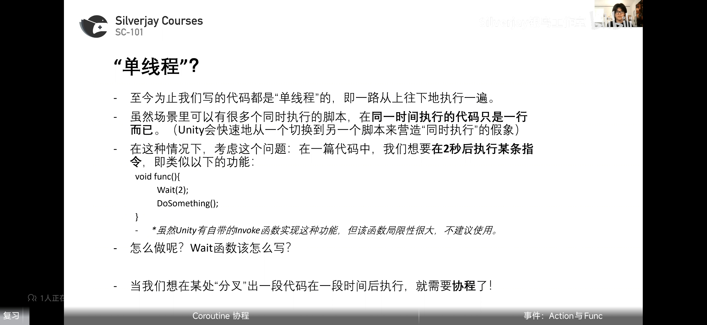
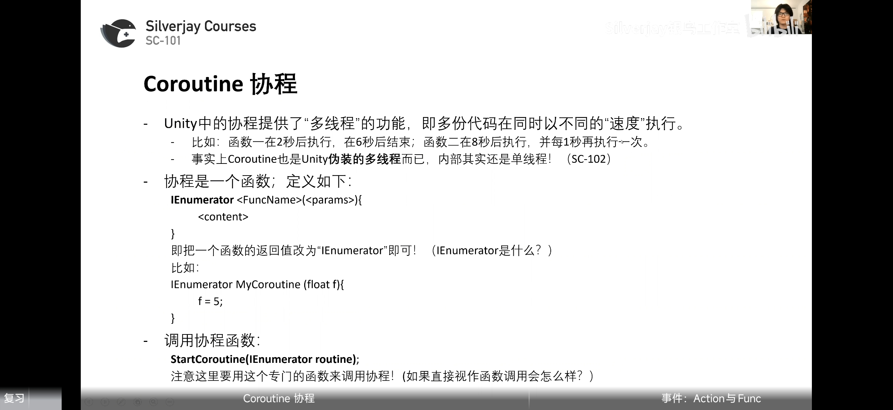

# 协程

**StartCoroutine(IEnumerator routine)调用协程**


### yield


### WaitForSeconds

**提前创建waitForSeconds可以优化性能**

#### 让物体在两点间来回移动
```csharp
    IEnumerator MovePlatform(float speed)
    {
        float t = 0;
        int dir = 1;
        while (true)
        {
            t += dir * Time.deltaTime;
            if (t >= 1)
                dir = -1;
            if (t <= 0)
                dir = 1;
            //if(t>=1 || t <= 0)
            //{
            //    dir = -dir;
            //}

            movingPlatform.transform.position = Vector3.Lerp(p1.position, p2.position, t);
            yield return null;
        }

    }
```
这里不能用下面那种方式因为每帧时间间隔不同会导致每帧移动距离不同，最后可能会在边界处卡住一段时间。

# 事件

### Action/Func

### Action 无返回值

返回void,+=,-=
可以当函数来调用

**可以传参**


### Func有返回值

模板最后一个参数为返回类型
且必须有返回值
**如果Func内有多个函数，那么返回值是什么？**


课后习题
```csharp
using System.Collections;
using System.Collections.Generic;
using Unity.VisualScripting;
using UnityEngine;

/// <summary>
/// SC-101 第七课课后练习
/// </summary>
public class L07_Exercise : MonoBehaviour
{
    public GameObject circle, square, diamond;
    [SerializeField]private int speed=1;
    void Start()
    {
        
        // Task 1 （简单）
        // 让circle以每秒2单位的速度移动至square处并停下
        //StartCoroutine(Task1());


        // Task 2 （中等）
        // 让square在停顿1秒后，再在3秒钟之内移动至diamond的位置
        // Hint: yield return new WaitForFixedUpdate();
        //StartCoroutine(Task2());

        // Task 3 （中等）
        // 让circle、square、diamond三个物体的scale以一定的速度在1和2之间不断来回移动
        StartCoroutine(Task3());
    }
    IEnumerator Task1()
    {
        speed =  2;
        Vector3 dr = Vector3.Normalize(square.transform.position - circle.transform.position);
        float epsilon = 0.01f;
        while (true)
        {
            circle.transform.Translate(speed*dr*Time.deltaTime);
            if(Vector3.Distance(square.transform.position, circle.transform.position) < epsilon)
            {
                circle.transform.position = square.transform.position;
                break;
            }
            yield return null;
        }
    }

    IEnumerator Task2()
    {
        yield return new WaitForSeconds(1);
        float t = 0, temp = 0;
        int TIME = 3;
        float epsilon = 0.01f;
        while (true)
        {
            temp += Time.fixedDeltaTime;
            t = temp / TIME;
            square.transform.position = Vector3.Lerp(square.transform.position, diamond.transform.position, t);
            if (Vector3.Distance(square.transform.position, diamond.transform.position) < epsilon)
            {
                square.transform.position = diamond.transform.position;
                break;
            }
            yield return new WaitForFixedUpdate();
        }
    }
    IEnumerator Task3()
    {
        Vector3 a =new Vector3(1.0f,1.0f,1.0f), b ;
        b = a * 2;
        float t = 0f;
        int dr = 1;
        Vector3 scale;
        while (true)
        {

            t += Time.deltaTime * speed * dr;
            if (t >= 1) dr = -1;
            if(t<=0) dr = 1;
            print(t);
            scale = Vector3.Lerp(a, b, t);
            circle.transform.localScale = scale;
            square.transform.localScale = scale;
            diamond.transform.localScale = scale;

            yield return null;
        }
    }

    //IEnumerator Task1()
    //{
    //    // 让circle以每秒2单位的速度移动至square处并停下
    //    float speed = 2;
    //    float epsilon = 0.01f; //代表很小的值，当circle和square之间的距离小于这个值时就算“到了”
    //    Vector3 dir = square.transform.position - circle.transform.position; //得到移动方向
    //    dir.Normalize(); //只需要方向，不需要长度
    //    while (true)
    //    {
    //        circle.transform.Translate(dir * speed * Time.deltaTime); //向该方向移动
    //        if(Vector3.Distance(square.transform.position, circle.transform.position) < epsilon) //如果很接近了
    //        {
    //            circle.transform.position = square.transform.position; //到位置了
    //            break; //停下
    //        }
    //        yield return null; //每帧执行
    //    }
    //}
    //IEnumerator Task2()
    //{
    //    // 让square在停顿1秒后，再在3秒钟之内移动至diamond的位置
    //    // Hint: yield return new WaitForFixedUpdate();

    //    yield return new WaitForSeconds(1); //先等一秒
    //    float deltaTime = Time.fixedDeltaTime;  //每固定帧的时长
    //    float stepCount = 3.0f / deltaTime; //一共要循环这么多步

    //    Vector3 road = diamond.transform.position - square.transform.position; //总共的路程

    //    for (int i = 0; i < stepCount; i++) //开始循环
    //    {
    //        square.transform.Translate(road / stepCount); //每个固定帧沿着路走一个step
    //        yield return new WaitForFixedUpdate(); //等到下一个固定帧
    //    }
    //}
    //IEnumerator Task3()
    //{
    //    // 让circle、square、diamond三个物体的scale以一定的速度在1和2之间不断来回移动

    //    float progress = 0; //一个0到1的值，用于lerp
    //    int dir = 1; //代表现在正在变大还是变小
    //    float speed = 2; //变化的速度
    //    while (true)
    //    {
    //        progress += dir * Time.deltaTime * speed; //让progress在0到1之间朝着dir的方向移动
    //        if (progress >= 1) dir = -1; //如果大于1，开始变小
    //        if (progress <= 0) dir = 1; //如果小于0，开始变大

    //        //让三个物体的scale等于（1，1，1）和（2，2，2）之间的一个值（由progress决定）
    //        circle.transform.localScale = square.transform.localScale = diamond.transform.localScale = Vector3.Lerp(Vector3.one, Vector3.one*2, progress); 
    //        yield return null; //每帧执行
    //    }
    //}
}

```