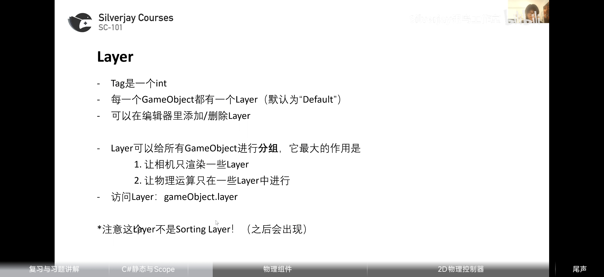
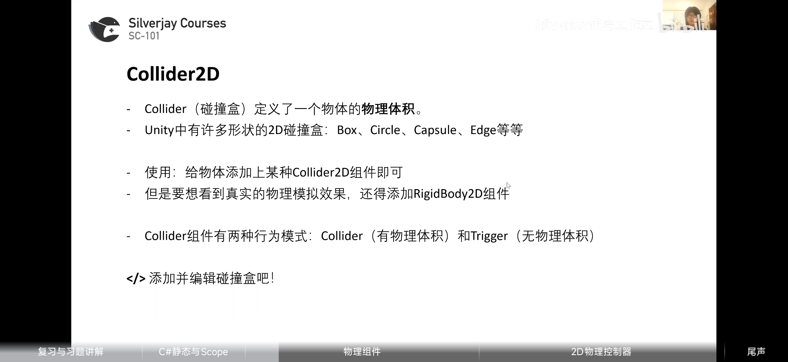
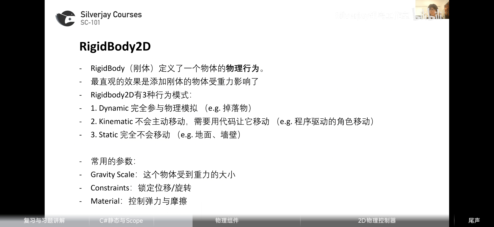
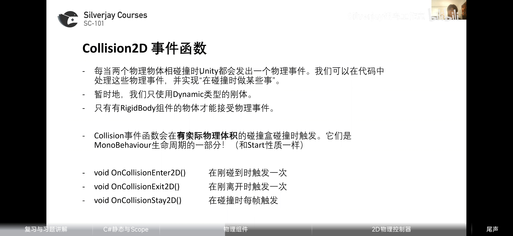
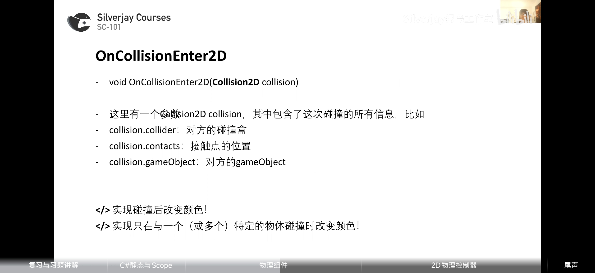
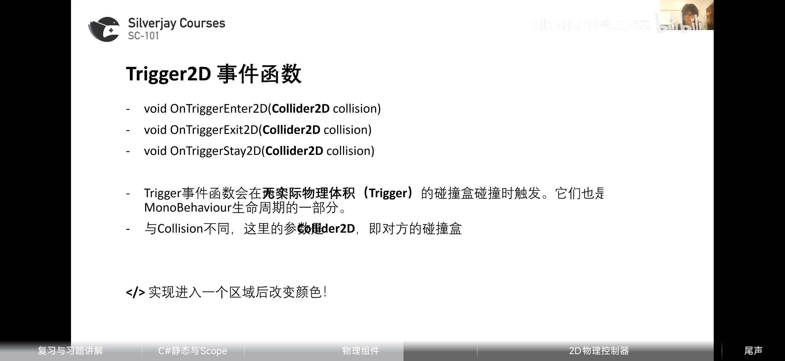
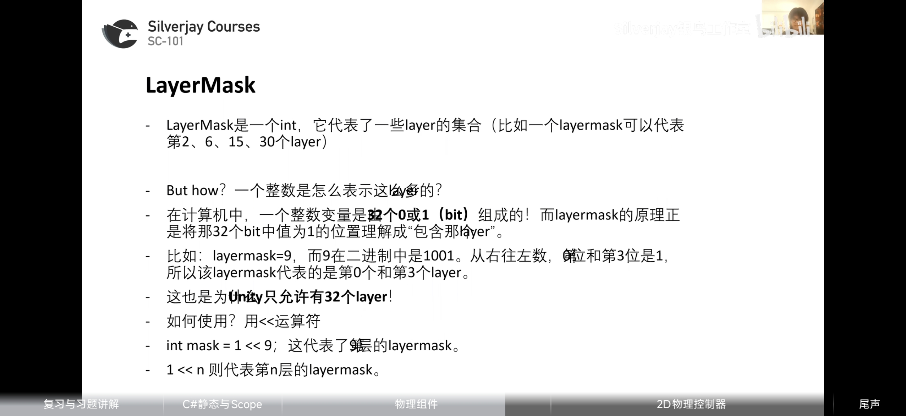

### 1，Tag

对于每一个实体可以添加tag，用于定位与分类

### 2，Layer

可以进行分组，共32个组别与后续整型代表layer集合相呼应

### 3，Colider2D

### 4,RigidBody2D

### 5,Colision2D事件函数

碰撞箱物理碰撞检测
##### 1）OnCollisionEnter2D

### 6，Trigger2D事件函数

碰撞箱触发器检测

### 7，LayerMask

多位赋值方式未
int mask = 1<<9|1<<15;
或者 mask |= 1<<7;

### 8,射线检测 Raycast

9，平台跳跃

跳跃移动代码，射线检测检测是否位于地面，origin先获取中心位置再减去y轴半径即为底部

跳跃时施加一个力

设置好后能从下到上跳跃到平台

