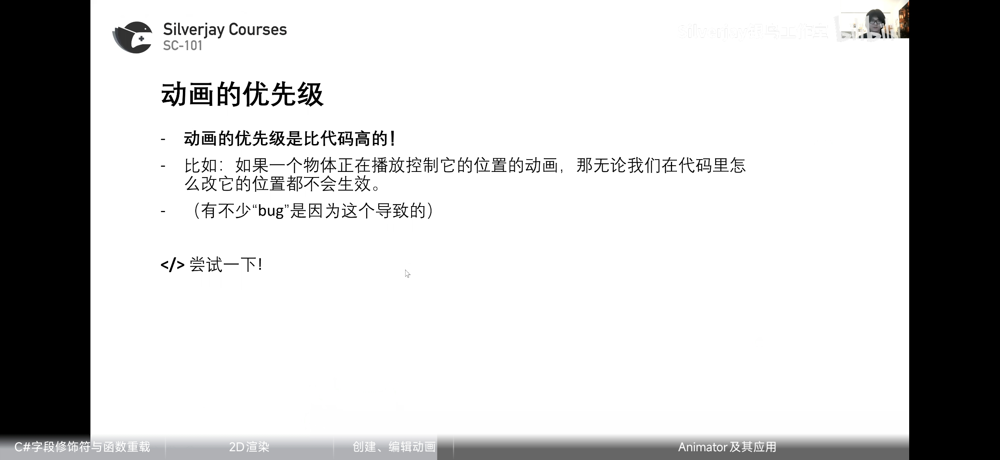
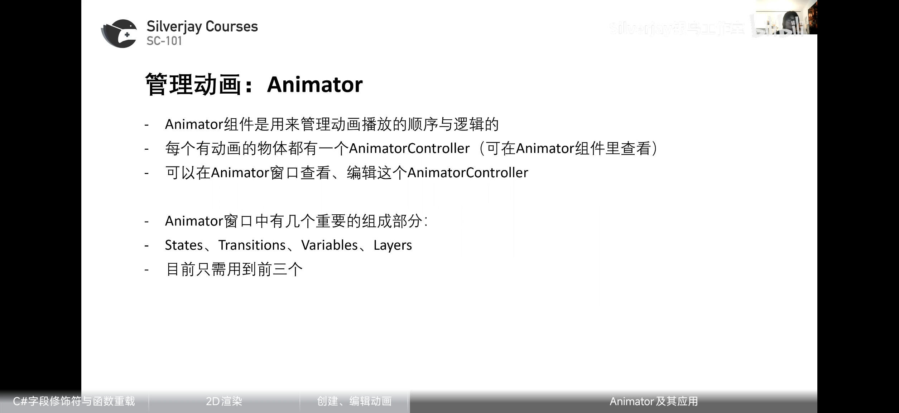
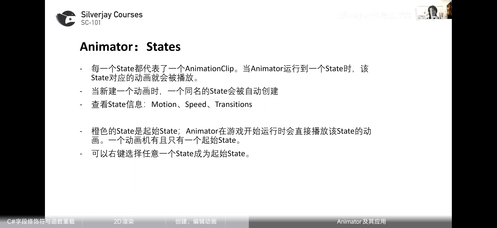
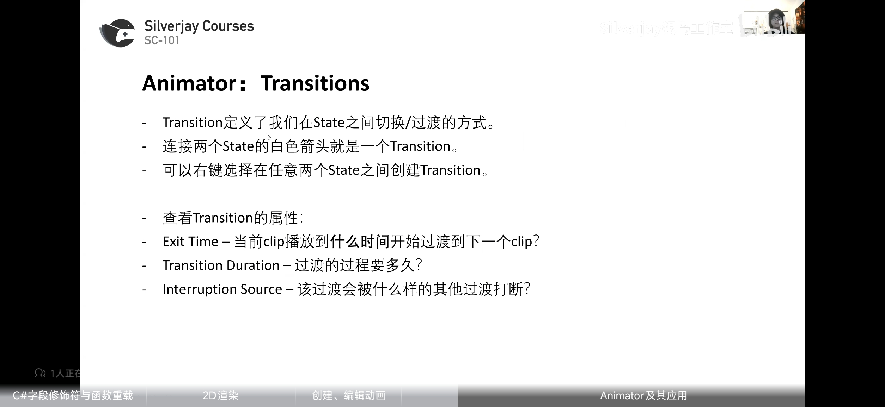
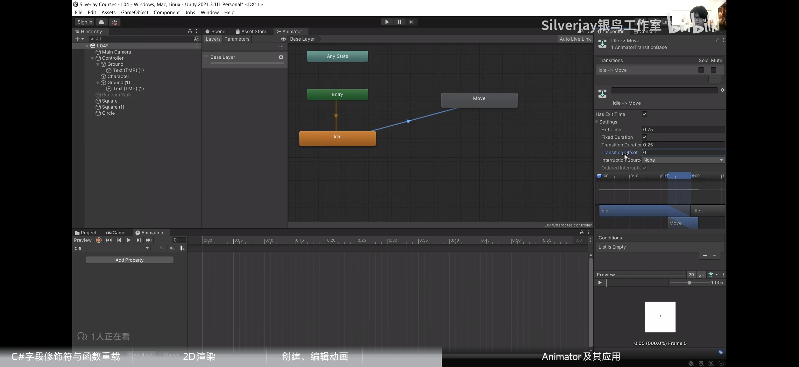
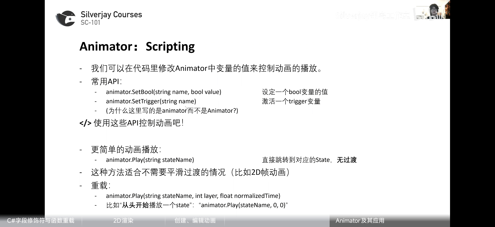
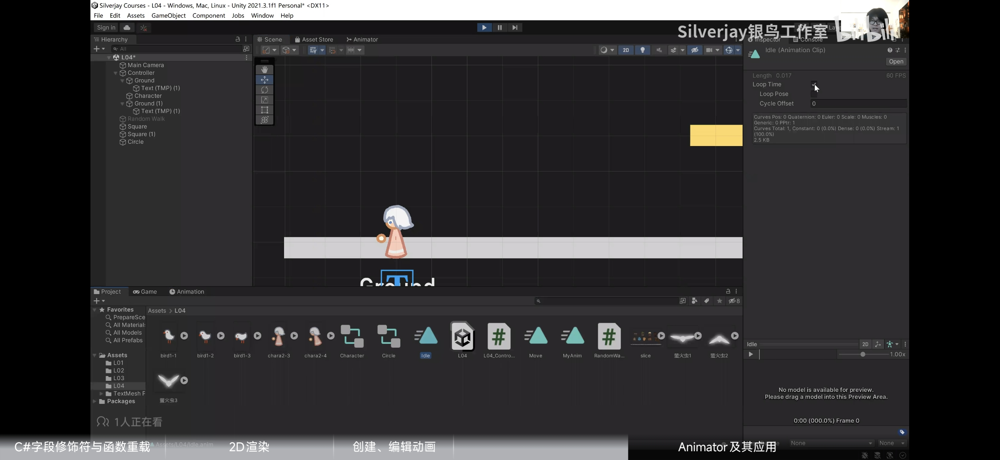
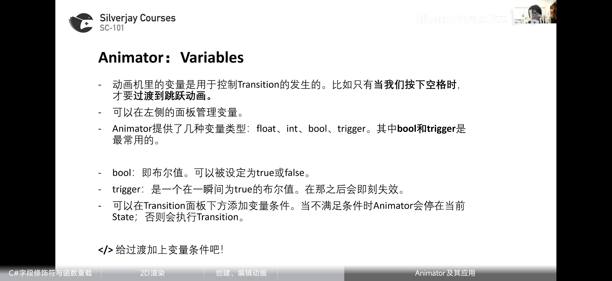
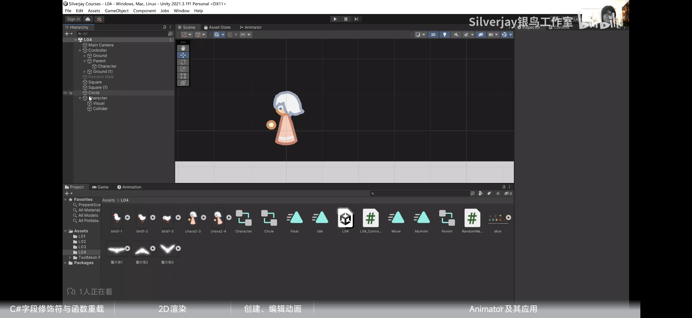

### 字段修饰符与函数重载
###### serializeField让private变量在引擎显示
##### range限制范围

### 2D渲染
##### 1，SpriteRenderer组件

##### 2，SpriteMask组件

##### 3，Sprite和Sprite Editor

图片具有类型
### Unity的动画系统
##### 1，Animation窗口编辑动画片段

**注：动画优先级比代码高，可能最高**

##### 2，Animator管理动画片段间的逻辑与顺序

###### States代表AnimationClip

###### Transitions定义States之间的切换/过渡方式

###### Scripting,修改变量控制动画播放

LoopTime默认勾选循环播放

###### Variables控制Transition的发生的。

##### 注意点

Regidbody2D组件可以通过Constraints的Freeze Rotation来关闭翻转

**可以通过绑定父物体来实现上下浮动等动画控制position的情况**
若直接通过动画会因为动画的高优先级忽视代码的控制
**也可以在父物体下通过图像与碰撞盒子物体分离达到好的效果**
