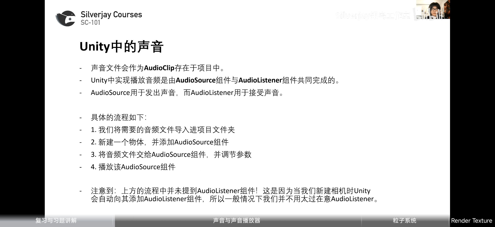
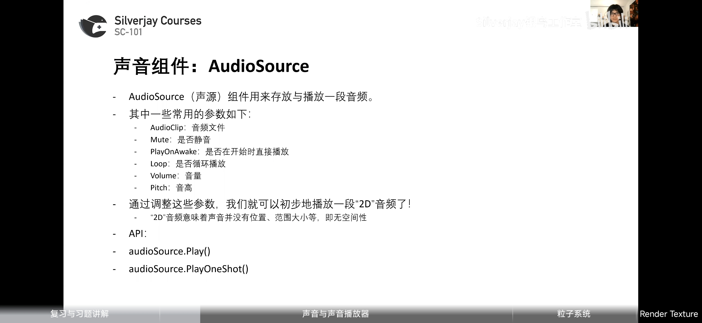
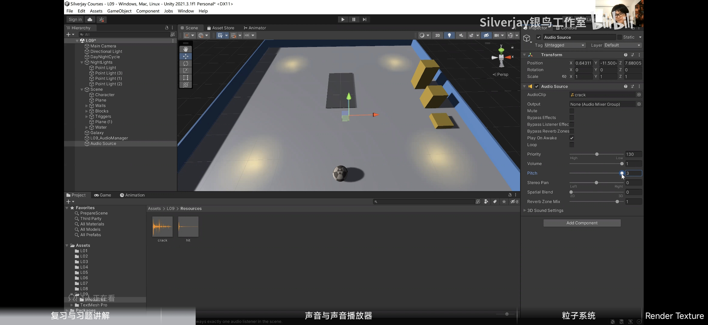

# 声音与声音播放器

### AudioSource



Play会被打断，PlayOneShot不会被打断
##### API


### Resources.Load


### 声音播放器

##### 编写与性能优化


```Csharp
using System.Collections;
using System.Collections.Generic;
using UnityEngine;

public class L09_AudioManager : MonoBehaviour 
{
    private static AudioSource audioSource;
    private static Dictionary<string, AudioClip> clipDict = new Dictionary<string,     AudioClip>();
    private void Awake()
    {
        audioSource = new GameObject("Audio Source").AddComponent<AudioSource>();
    }

    public static void Play(string clipName)
    {
        if (!clipDict.ContainsKey(clipName))
            clipDict.Add(clipName, Resources.Load<AudioClip>(clipName));
        audioSource.clip = clipDict[clipName];

        audioSource.Play();
    }

    public static void PlayOneShot(string clipName)
    {
        if (!clipDict.ContainsKey(clipName))
            clipDict.Add(clipName, Resources.Load<AudioClip>(clipName));

        audioSource.PlayOneShot(clipDict[clipName]);
    }

    public static void Pause()
    {
        audioSource.Pause();
    }

    public static void Stop()
    {
        audioSource.Stop();
    }

    public static void SetVolume(float volume)
    {
        audioSource.volume = volume;
    }

    public static void SetPitch(float pitch)
    {
        audioSource.pitch = pitch;
    }


}

```

##### Dictionary
