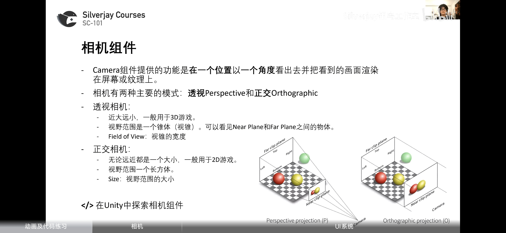
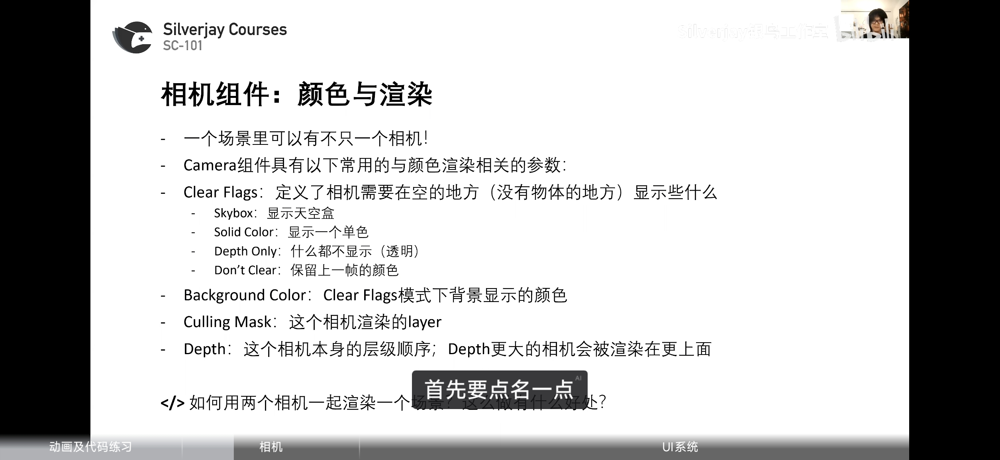
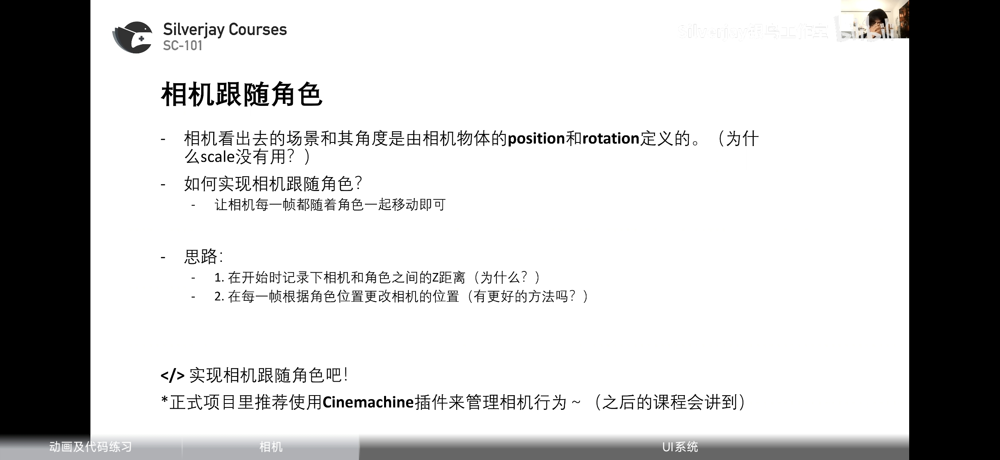
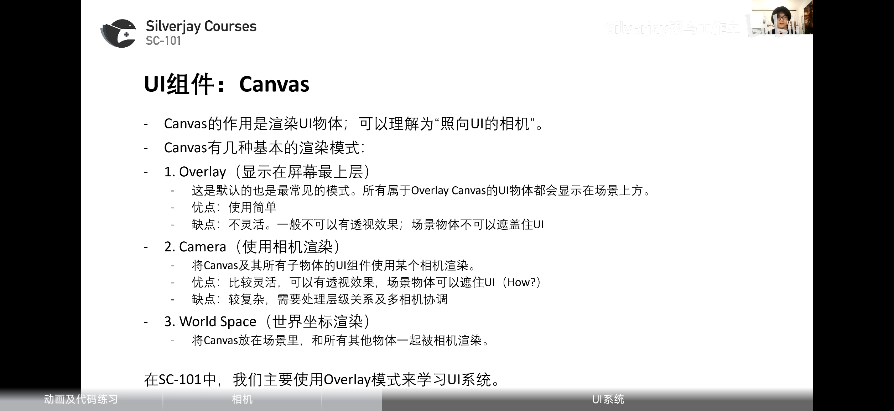
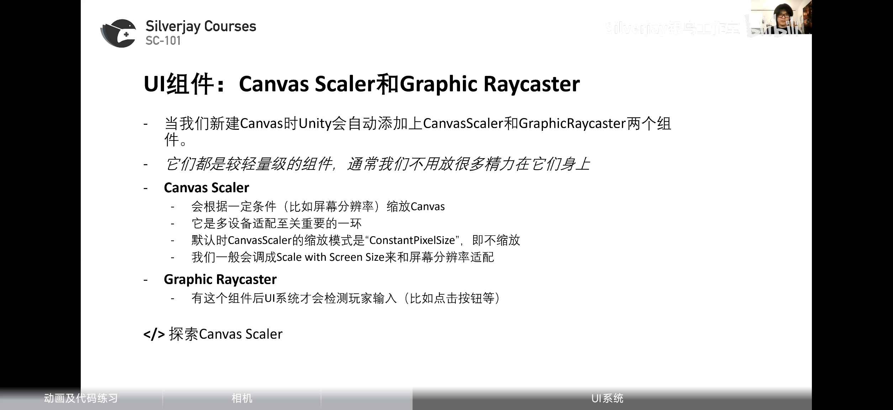
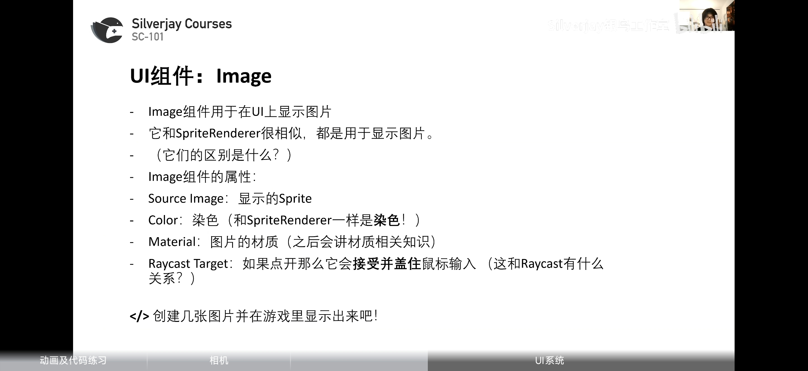
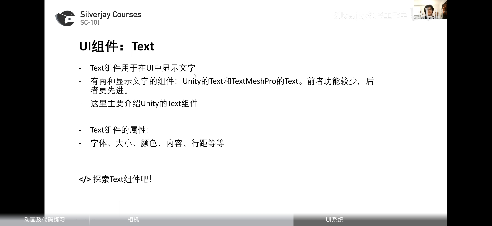

# 一，相机
### 相机组件

相机如何跟随角色：先获取开始时相机与角色的向量差，之后更新相机的position为玩家的position加上该向量差
# 二，UI系统

### Canavas

### Image

### Text

text可以采用先组件放大，再按T使用框型工具缩小使字体更清晰
### button

##### 1,按钮的触发范围是button及其子物体有Raycast Target并且
有颜色（包括透明但早期不行）的地方
##### 2，视觉效果的实现

Interactable：取消勾选则变暗下面效果失效
Normal：普通状态
Highlighted:经过状态
Pressed:  按下

Fade Duration：过渡时间
Transition 除了Color
还有Sprite Swap和Animation（高自定义）
##### 3，按钮的作用

点击触发事件**可以执行某一个组件中的public函数**
且最多**一个参数**。

### 代码中访问UI组件
先引入包
using UnityEngine.UI;

