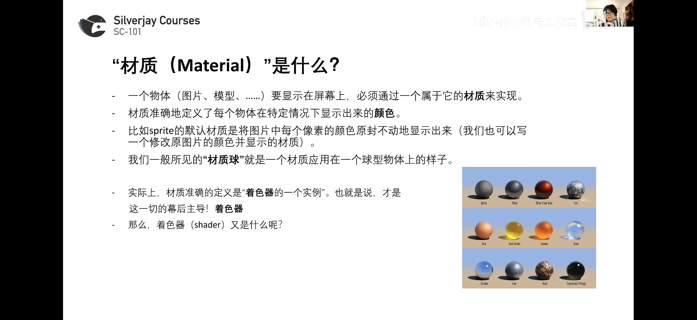
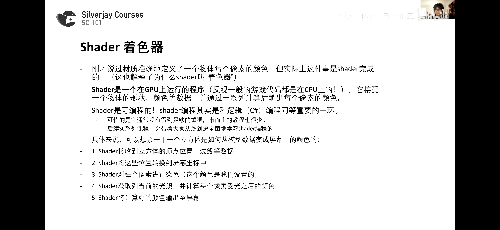
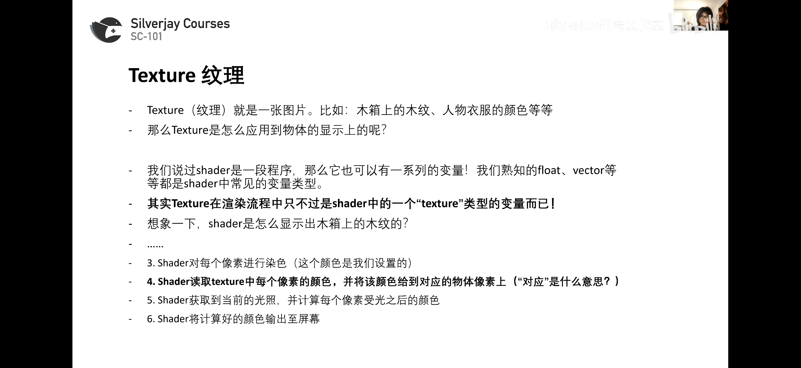
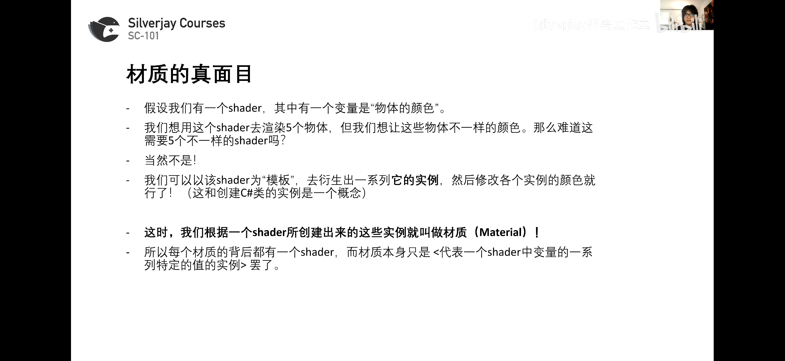
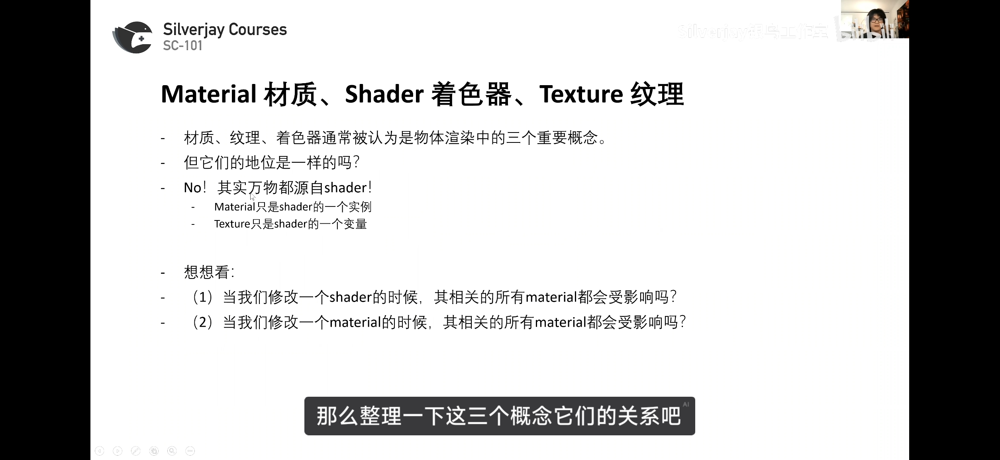
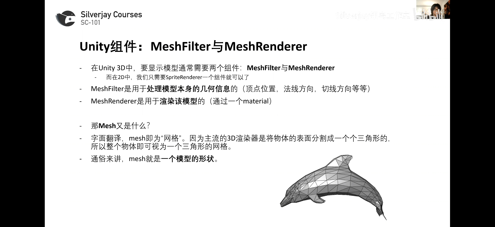

# 3D渲染
### 材质



### shader 着色器

### Texture 纹理

### 材质与shader


### 三者关系


### MeshFilter与MeshRenderer



### 材质参数


Render Queue决定渲染顺序，越小越优先
### Lighting 光照


### 总结

# 3D物理

### Collider

### Rigidbody


### 颜色过渡


```Csharp
using System.Collections;
using System.Collections.Generic;
using UnityEngine;

/// <summary>
/// SC-101 第八课练习解答：昼夜循环
/// </summary>
public class L09_DayNightCycle : MonoBehaviour
{
    const float DAWN_TIME = 0.15f; //太阳在这个时候升起
    const float NIGHT_TIME = 0.85f; //太阳在这个时候落下
    const float NIGHTLIGHT_INTENSITY = 2f; //晚上灯光的亮度
    const float NIGHTLIGHT_DAMP = 0.05f; //昼夜灯光的过渡时间

    [SerializeField] private Light sunlight; //太阳光

    public float dayLength = 10; //一天的时长（秒）
    public bool autoUpdate = false;
    [Range(0,1)]
    public float timeOfDay = 0; //0-1的值，代表当前在一天之内的时间

    public Gradient lightColor; //一天之中太阳光的颜色

    private List<Light> nightlights = new List<Light>(); //所有的夜灯物体

    private void Start()
    {
        //找到装有夜灯的物体
        Transform nightLightParent = GameObject.Find("NightLights").transform;
        int count = nightLightParent.childCount;
        for (int i = 0; i<count;i++)
        {
            //把每个夜灯加进List中
            nightlights.Add(nightLightParent.GetChild(i).GetComponent<Light>());
        }
    }
    void FixedUpdate()
    {
        if (autoUpdate)
        {
            timeOfDay += Time.fixedDeltaTime / dayLength; //每帧更新当前时间
            if (timeOfDay >= 1)
                timeOfDay = 0; //下一天
        }
        UpdateLighting();
    }

    /// <summary>
    /// 根据时间更新场景光照
    /// </summary>
    void UpdateLighting()
    {
        sunlight.color = lightColor.Evaluate(timeOfDay); //调整阳光颜色
        Vector3 lightAngle = new Vector3(Mathf.Lerp(-180, -360, timeOfDay), -90, 0);
        sunlight.transform.rotation = Quaternion.Euler(lightAngle);

        //调整每个夜灯的亮度
        for(int i = 0; i < nightlights.Count; i++)
        {
            Light light = nightlights[i];
            //夜晚时intensity为白天intensity为NIGHTLIGHT_INTENSITY，白天intensity为0
            //Smoothstep： 平滑过渡
            light.intensity = (1- Smoothstep(DAWN_TIME - NIGHTLIGHT_DAMP, DAWN_TIME + NIGHTLIGHT_DAMP, timeOfDay) *
                Smoothstep(NIGHT_TIME + NIGHTLIGHT_DAMP, NIGHT_TIME - NIGHTLIGHT_DAMP, timeOfDay)) * 
                NIGHTLIGHT_INTENSITY;
        }

        //指shader语言中的（HLSL）的smoothstep
        //不是指Mathf.SmoothStep
    }
    float Smoothstep(float a, float b, float x)
    {
        float t = Mathf.Clamp01((x - a) / (b - a));
        return t * t * (3.0f - (2.0f * t));
    }
}

```
