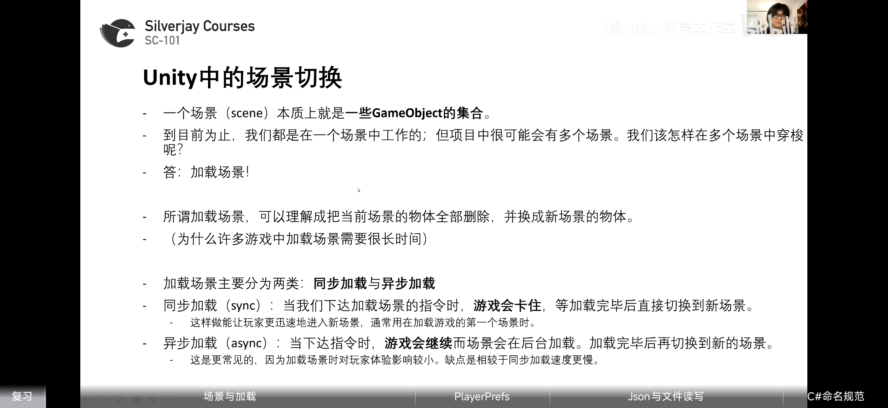
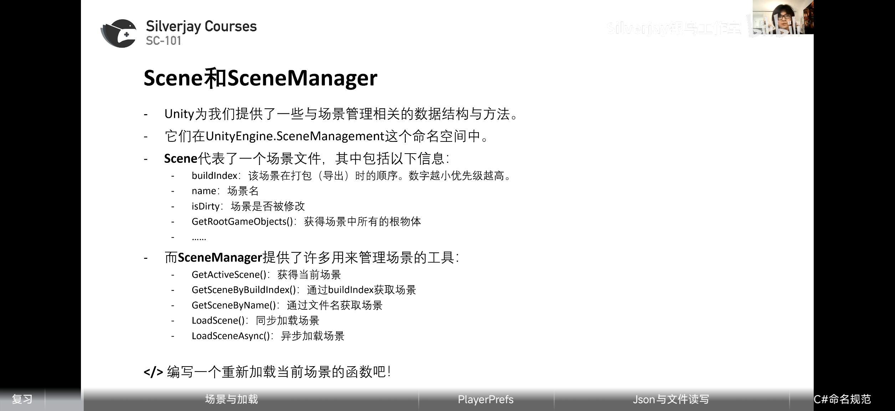
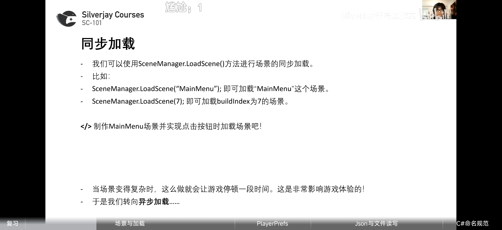
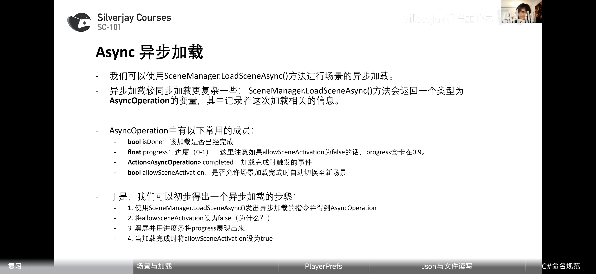
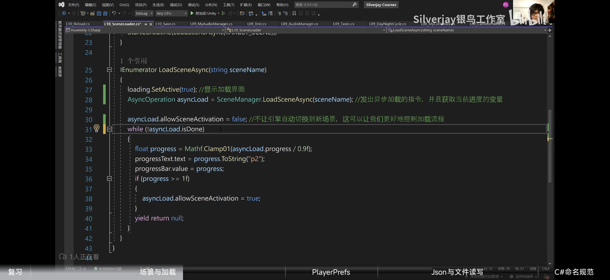
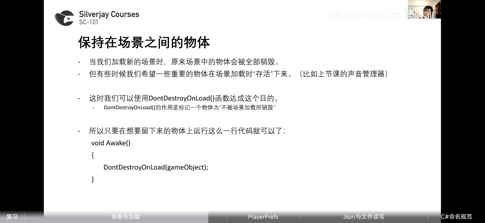
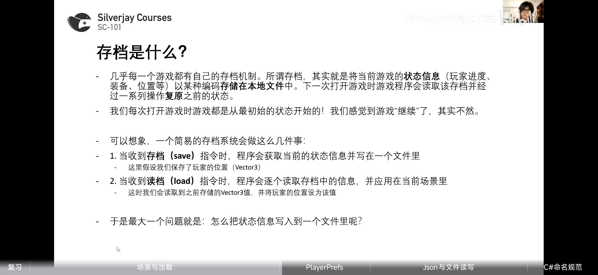

# 场景
### 场景切换

### Scene与SeneManager

##### 同步加载

### Async异步加载

##### DontDestroyOnLoad（）函数

# 存档

### PlayerPref（简易，不常用）

#### 限制

### 文件读写
#### File类

#### Unity的数据路径

### json

#### jsonUtility局限性

# C#命名规范
