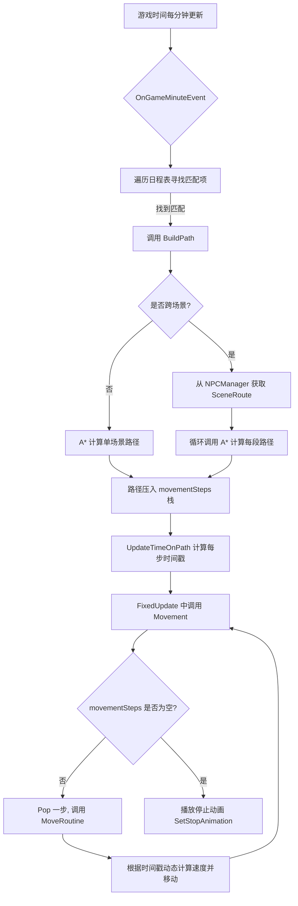

## 利用AStar实现NPC的移动

### 🗓️ NPC 日程与移动系统核心笔记

这份笔记基于 `NPCMovement`、`NPCManager` 及相关数据类的代码实现，涵盖了从日程数据定义、路径规划到移动与动画控制的完整流程。

#### 1. 核心数据结构

**🔹 ScheduleDetails (日程详情)**  
这是 NPC 日程的最小单位，使用 `[Serializable]` 标记，可在编辑器中配置。

- **目标信息**:
    - `targetScene`: 目标场景名称。
    - `targetGridPos`: 目标网格坐标。
- **时间信息**:
    - `hour`, `minute`: 计划执行的小时和分钟。
    - `day`: 计划执行的日期 (0 表示每天)。
    - `season`: 计划执行的季节。
- **行为控制**:
    - `priority`: 优先级，数值越小优先级越高。
    - `clipAtStop`: 到达目标后播放的动画片段。
    - `interactable`: 到达后是否可与玩家交互。
- **排序逻辑 (`IComparable`)**:
    1. 优先比较 `Time` (时间戳，格式为 `hour * 100 + minute`)。
    2. 若时间相同，则比较 `priority` (优先级)。

**🔹 场景路径数据 (SceneRoute)**  
用于管理跨场景移动的路径。

- **ScenePath**: 定义单个场景内的路径段，包含 `sceneName`、`fromGridPos` (入口) 和 `toGridPos` (出口)。
- **SceneRoute**: 定义从一个场景到另一个场景的完整路线，包含一个 `List<ScenePath>`。
- **SceneRouteDataList_SO**: `ScriptableObject`，存储所有 `SceneRoute` 的列表。

---

#### 2. 核心管理器 (NPCManager)

`NPCManager` 是一个单例，负责管理所有场景间的路由数据。

- **数据结构**: 使用 `Dictionary<string, SceneRoute>` 存储路由，键为 `"fromScene_toScene"`。
- **初始化 (`InitSceneRouteDict`)**: 在 `Awake` 时，遍历 `SceneRouteDataList_SO`，将所有路线数据存入字典。
- **获取路线 (`GetSceneRoute`)**: 根据起始场景和目标场景名称，从字典中查找并返回对应的 `SceneRoute`。

---

#### 3. 核心逻辑层 (NPCMovement)

`NPCMovement` 脚本挂载在 NPC 上，是驱动 NPC 移动和行为的中心。

**🔹 依赖与组件**

- **依赖组件**: `[RequireComponent(typeof(Rigidbody2D))]` 和 `[RequireComponent(typeof(Animator))]`。
- **核心组件**: `Rigidbody2D` (物理移动), `Animator` (动画控制), `BoxCollider2D` (碰撞检测)。
- **数据结构**: 使用 `SortedSet<ScheduleDetails>` 存储日程，利用其自动排序特性。使用 `Stack<MovementStep>` 存储由 A* 算法生成的路径。

**🔹 交互与事件**

1. **事件监听**:
    - `AfterSceneLoadedEvent`: 场景加载后，初始化 NPC 位置并检查可见性。
    - `BeforeSceneUnloadEvent`: 场景卸载前，标记 `sceneLoaded = false` 以暂停移动。
    - `GameMinuteEvent`: 游戏时间每分钟更新时触发，用于检查日程。
2. **日程检查 (`OnGameMinuteEvent`)**:
    - 遍历 `scheduleDetailsSet` (已排序)。
    - 匹配当前游戏时间、日期和季节。
    - 一旦找到匹配项，立即调用 `BuildPath` 规划新路径并跳出循环。

**🔹 路径规划 (`BuildPath`)**  
这是移动前的核心准备步骤。

1. **同场景移动**: 如果 `schedule.targetScene` 与 `currentScene` 相同，直接调用 `AStar.Instance.BuildPath` 计算路径。
2. **跨场景移动**:
    - 通过 `NPCManager.Instance.GetSceneRoute` 获取完整路线。
    - 遍历路线中的每个 `ScenePath`。
    - 对每一段路径，分别调用 `AStar.Instance.BuildPath`，将多段路径依次压入同一个 `movementSteps` 栈中。
3. **时间戳更新 (`UpdateTimeOnPath`)**:
    - 遍历 `movementSteps` 栈，为路径上的每一步计算并设置预计到达的 `hour`, `minute`, `second`。
    - 根据移动是直线还是对角线，使用不同的速度 (`Settings.gridCellSize` vs `Settings.gridCellDiagonalSize`) 来计算耗时。

**🔹 移动执行 (`Movement` & `MoveRoutine`)**

1. **主循环 (`Movement`)**: 在 `FixedUpdate` 中调用。
    - 如果 `movementSteps` 栈不为空，弹出一个 `MovementStep`。
    - 更新 `currentScene` 并调用 `CheckVisable()` 处理跨场景时的显示/隐藏。
    - 调用 `MoveToGridPosition` 开始移动。
    - 如果栈为空且 NPC 静止，则播放停止动画 (`SetStopAnimation`)。
2. **移动协程 (`MoveRoutine`)**:
    - **速度计算**: 核心逻辑。根据 `(目标时间 - 当前游戏时间)` 和距离，动态计算移动速度，确保 NPC 能准时到达。
        - `speed = distance / timeToMove`
        - 速度会被限制在 `minSpeed` 和 `maxSpeed` 之间。
    - **物理移动**: 使用 `Rigidbody2D.MovePosition` 进行平滑移动。
    - **到达**: 移动完成后，更新 `currentGridPos`，并设置 `npcMove = false`，允许进行下一步移动。

**🔹 动画控制 (`SwitchAnimation`)**

- 根据 `isMoving` 状态切换 "IsMoving" 参数。
- 根据移动方向 `dir` 更新 "DirX" 和 "DirY" 参数。
- 使用 `AnimatorOverrideController` 在到达目标时动态替换动画片段 (`blankAnimationClip` -> `stopAnimationClip`)。

---

#### 4. 关键流程图解

#### 表格

|组件/方法|作用|关键逻辑|
|---|---|---|
|**ScheduleDetails**|数据载体|实现 `IComparable` 用于自动排序，包含时间、地点、行为|
|**NPCManager**|路由管理|单例模式，使用字典缓存 `SceneRoute` 数据，快速查找|
|**NPCMovement**|行为驱动|监听时间事件，调用 A* 寻路，控制物理移动和动画|
|**BuildPath**|路径构建|支持跨场景路径拼接，将多段 A* 路径合并到一个栈中|
|**MoveRoutine**|移动执行|**核心**：根据剩余时间和距离动态计算速度，实现“准时到达”|

**💡 复习提示**:

- **SortedSet**: 日程表使用 `SortedSet` 而不是 `List`，因为它能自动根据 `ScheduleDetails` 的比较逻辑（时间、优先级）进行排序，简化了查找逻辑。
- **跨场景移动**: 路径被分解为多个 `ScenePath`，A* 算法被多次调用，结果全部压入同一个 `Stack<MovementStep>`。移动时只需不断 `Pop`，无需关心是否跨场景。
- **动态速度**: `MoveRoutine` 中的速度计算是实现“日程”的关键。它不是固定速度移动，而是为了在指定时间点到达指定地点，这比传统的寻路更复杂也更智能。
- **时间戳**: `UpdateTimeOnPath` 为路径上的每一步都打上了时间戳，这是 `MoveRoutine` 能够计算速度的基础。