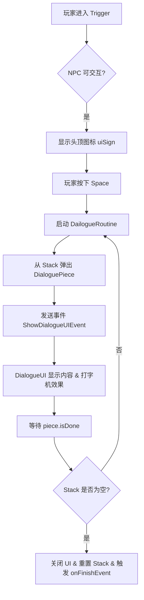

## 制作对话的UI
文本自适应，需要在上一级添加ContentSizeFitter和LayoutGroup开启ControlChildSIze，
当前文本组件可以添加LayoutElement进行最小最大大小控制

## 创建对话数据实现对话逻辑

### 🗣️ 对话系统核心笔记 (基于 MyFarm.Dialogue)

这份笔记基于 `MyFarm.Dialogue` 命名空间下的代码实现，涵盖了从数据定义、UI 控制到逻辑驱动（NPC 交互）的完整流程。

#### 1. 核心数据结构

**🔹 DialoguePiece (对话片段)**  
这是对话的最小单位，使用 `[System.Serializable]` 标记，可以在 Unity 编辑器中直接配置。

- **视觉表现**:
    - `faceImage`: 角色头像 (Sprite)。
    - `onLeft`: 布尔值，决定头像显示在左侧 (true) 还是右侧 (false)。
    - `name`: 说话者的名字。
    - `dialogueText`: 具体的对话内容 (支持多行文本)。
- **控制逻辑**:
    - `hasToPause`: 是否需要在对话结束后显示“继续”提示 (等待玩家按键)。
    - `isDone`: 运行时状态标记，用于协程同步，判断当前对话是否播放完毕。

---

#### 2. UI 表现层 (DialogueUI)

`DialogueUI` 负责管理对话框的显示、隐藏以及文本的逐字打印效果。

**🔹 核心组件**

- `dialoguePanel`: 整个对话框的根对象。
- `dailogueText`: 显示对话内容的 TextMeshPro 组件。
- `faceLeft` / `faceRight`: 左右两侧的头像 Image。
- `nameLeft` / `nameRight`: 左右两侧的名字 Text。
- `continueBox`: “继续”提示图标 (如箭头或按键提示)。

**🔹 关键逻辑**

1. **事件监听**: 在 `OnEnable` 中订阅 `EventHandler.ShowDialogueUIEvent`，在 `OnDisable` 中取消订阅。
2. **显示对话 (`ShowDialogues`)**:
    - 接收 `DialoguePiece` 数据。
    - **头像逻辑**: 根据 `piece.onLeft` 决定激活左侧还是右侧的头像/名字，并赋值 Sprite 和 Name。如果名字为空，则隐藏所有头像和名字。
    - **文本打字机效果**: 调用 `TypeText` 协程。
3. **打字机效果 (`TypeText`)**:
    - 利用 `textComponent.maxVisibleCharacters` 属性。
    - 通过 `WaitForSeconds` 控制每个字符显示的时间间隔 (`duration / totalLength`)，实现逐字显示。
    - 显示完毕后，如果 `hasToPause` 为真，激活 `continueBox`。

---

#### 3. 逻辑控制层 (DialogueController)

`DialogueController` 挂载在 NPC 上，负责检测玩家交互并驱动对话流程。

**🔹 依赖与组件**

- **依赖组件**: `[RequireComponent(typeof(NPCMovement))]` 和 `[RequireComponent(typeof(BoxCollider2D))]`。
- **数据结构**: 使用 `Stack<DialoguePiece>` (栈) 来存储对话列表，实现后进先出 (LIFO) 的播放顺序。
- **状态标记**:
    - `canTalk`: 玩家是否在触发范围内且 NPC 可交互。
    - `isTalking`: 是否正在进行对话，防止重复触发。

**🔹 交互流程**

1. **触发检测**:
    - `OnTriggerEnter2D`: 检测玩家进入。条件：玩家标签匹配、NPC 不在移动 (`!npc.isMoving`) 且可交互 (`npc.interactable`)。
    - `OnTriggerExit2D`: 玩家离开，`canTalk = false`。
2. **输入检测 (`Update`)**:
    - 显示/隐藏头顶提示图标 (`uiSign`)。
    - 如果 `canTalk` 且按下 `Space` 键且未在对话中，启动 `DailogueRoutine` 协程。
3. **对话循环 (`DailogueRoutine`)**:
    - 设置 `isTalking = true`。
    - **出栈**: 尝试从 `dialogueStack` 弹出一段对话 (`TryPop`)。
    - **发送事件**: 调用 `EventHandler.CallShowDialogueUIEvent(piece)` 通知 UI 显示。
    - **等待**: `yield return new WaitUntil(() => piece.isDone)`，等待 UI 播放完毕。
    - **结束处理**:
        - 如果栈空了 (对话结束)：发送空事件关闭 UI，重置 `isTalking`，调用 `FillDialogueStack()` 重置对话栈，并触发 `onFinishEvent` (可用于触发任务完成或剧情推进)。

**🔹 数据重置 (`FillDialogueStack`)**

- 遍历 `dialoguePieces` 列表，将 `isDone` 重置为 false。
- **逆序压栈**: 从列表最后一个元素开始 `Push` 到栈中，确保对话按列表顺序播放。

---

#### 4. 关键交互图解

#### 5. 总结与关键点速查

表格

|组件/类|作用|关键逻辑|
|---|---|---|
|**DialoguePiece**|数据载体|包含头像、名字、文本、位置标记|
|**DialogueUI**|视图层|处理打字机效果 (`maxVisibleCharacters`) 和头像切换|
|**DialogueController**|逻辑层|使用 `Stack` 管理流程，通过 `EventHandler` 通信|
|**EventHandler**|通信桥梁|解耦逻辑与 UI，通过事件传递 `DialoguePiece`|

**💡 复习提示**:

- **栈的应用**: 注意 `FillDialogueStack` 中为什么要**逆序**压栈。因为栈是后进先出，为了让列表的第一句对话最先出来，必须最后压入。
- **协程同步**: `WaitUntil(() => piece.isDone)` 是核心，它让逻辑层暂停，直到 UI 层把动画播完，避免了对话瞬间刷完的问题。